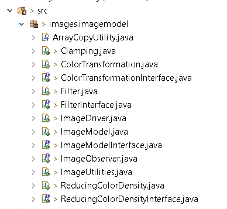
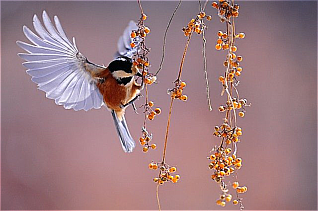
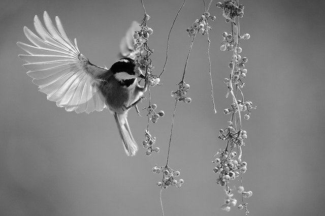
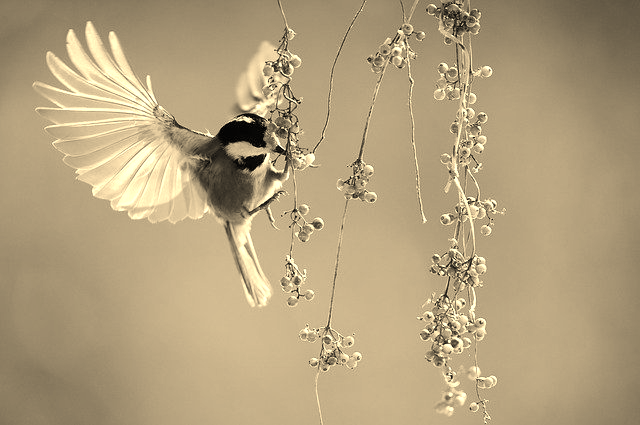
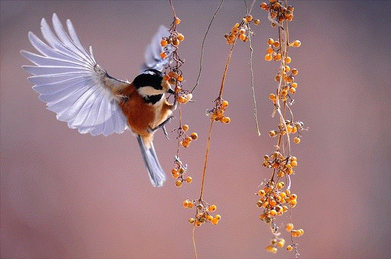
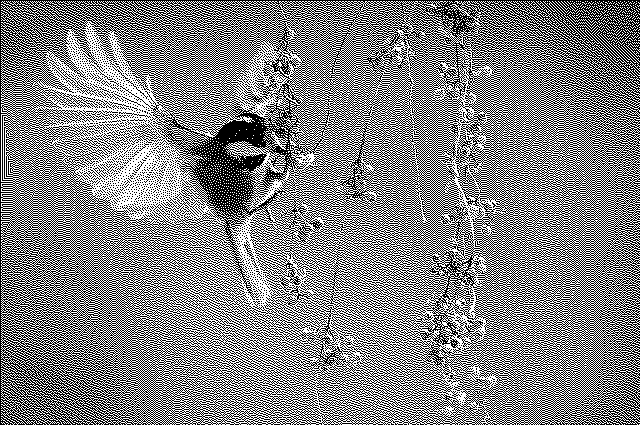

# Image Model

## Overview
Requirement is to build a model that can be used to manipulate images to produce some interesting effects.
- Loading and Saving Images:Standard representation is used where an image can be thought of as simply as a 3D array of integers with rows = height, columns = width and depth = 3. With 8-bit channels, each value is between 0 and 255.
- Filtering Images: A basic operation in many image processing algorithms is filtering. A filter has a "kernel", which is a 2D array of numbers, having odd dimensions (3x3, 5x5, etc.). Given a pixel in the image and a channel, the result of the filter can be computed for that pixel and channel.
- Color transformations: Filtering modifies the value of a pixel depending on the values of its neighbors. Filtering is applied separately to each channel. In contrast, a color transformation modifies the color of a pixel based on its own color. Consider a pixel with color LaTeX: (r,g,b)( r , g , b ). A color transformation results in the new color of this pixel to be LaTeX: (r',g',b')( r ′ , g ′ , b ′ ) such that each of them are dependent only on the values LaTeX: (r,g,b)( r , g , b ).
- Reducing color density: One of the ways to transform the colors in an image is to reduce the number of colors in the image.The technique for preserving the essence of the image breaks down an image that has many colors into an image that is made of dots from just a few colors is known as dithering. A popular technique to dither an image is the Floyd-Steinberg algorithm 
## List of features.
- Loading and Saving Images
- Filtering Images - Different filters like image blur and image sharpening could be applied.
- Color transformations- Different color transformations like grey scale and sepia tone could be applied.
- Reducing color density - Another way to transform the colors in an image is to reduce the number of colors in the image.

## How To Run. 

Image Model package will have the below mentioned folder structure: 



- jar file is saved in the \res folder

- Open the \res folder in command shell

- run the command as below, program does need two arguments from the user. Argument 1 is first image path and argument 2 is second image path
 
```sh
> java -jar .\ImageModel.jar .\Images\Image1\Original.png .\Images\Image2\Original.png
```
 
 
                              

 ## How to Use the Program.
     
There is no interaction with the user, so user just have to run the jar file as mentioned above with two arguments(image path)
    
## Description of Example Runs

Results of running the ImageModel.jar file

```sh  
PS C:\Manushi\ProjectsWorkSpace\ImageModel\res> java -jar .\ImageModel.jar .\Images\Image1\Original.png .\Images\Image2\Original.png
******************Starting Processing for first image******************

First image Loaded

Applied Color Transformation - Gray Scale on the original image

File saved at C:\Manushi\ProjectsWorkSpace\ImageModel\res\Images\Image1\GrayScale1.png

Applied Color Transformation - Sepia Tone on the original image

File saved at C:\Manushi\ProjectsWorkSpace\ImageModel\res\Images\Image1\SepiaTone1.png

Applied Filter - Blur on the original image

File saved at C:\Manushi\ProjectsWorkSpace\ImageModel\res\Images\Image1\Blur1.png

Applied Filter - Blur on the blured image

File saved at C:\Manushi\ProjectsWorkSpace\ImageModel\res\Images\Image1\Blur2.png

Applied Filter - Sharpness on the original image

File saved at C:\Manushi\ProjectsWorkSpace\ImageModel\res\Images\Image1\Sharp1.png

Applied Filter - Sharpness on the sharped image

File saved at C:\Manushi\ProjectsWorkSpace\ImageModel\res\Images\Image1\Sharp2.png

Reduced Color Density to 512(8X8X8) colors with essence on the original image

File saved at C:\Manushi\ProjectsWorkSpace\ImageModel\res\Images\Image1\ReduceCD512Colors.png

Reduced Color Density to 512(8X8X8) colors without essence on the original image

File saved at C:\Manushi\ProjectsWorkSpace\ImageModel\res\Images\Image1\ReduceCD512WithoutEssence.png

Reduced Color Density to 8(2X2X2) colors with essence on the gray scale image

File saved at C:\Manushi\ProjectsWorkSpace\ImageModel\res\Images\Image1\ReduceCD8GrayColors.png

******************Starting Processing for second image******************

Second image Loaded

Applied Color Transformation - Gray Scale on the original image

File saved at C:\Manushi\ProjectsWorkSpace\ImageModel\res\Images\Image2\GrayScale1.png

Applied Color Transformation - Sepia Tone on the original image

File saved at C:\Manushi\ProjectsWorkSpace\ImageModel\res\Images\Image2\SepiaTone1.png

Applied Filter - Blur on the original image

File saved at C:\Manushi\ProjectsWorkSpace\ImageModel\res\Images\Image2\Blur1.png

Applied Filter - Blur on the blured image

File saved at C:\Manushi\ProjectsWorkSpace\ImageModel\res\Images\Image2\Blur2.png

Applied Filter - Sharpness on the original image

File saved at C:\Manushi\ProjectsWorkSpace\ImageModel\res\Images\Image2\Sharp1.png

Applied Filter - Sharpness on the sharped image

File saved at C:\Manushi\ProjectsWorkSpace\ImageModel\res\Images\Image2\Sharp2.png

Reduced Color Density to 512(8X8X8) colors on the original image

File saved at C:\Manushi\ProjectsWorkSpace\ImageModel\res\Images\Image2\ReduceCD512Colors.png

Reduced Color Density to 512(8X8X8) colors without essence on the original image

File saved at C:\Manushi\ProjectsWorkSpace\ImageModel\res\Images\Image2\ReduceCD512WithoutEssence.png

Reduced Color Density to 8(2X2X2) colors on the gray scale image

File saved at C:\Manushi\ProjectsWorkSpace\ImageModel\res\Images\Image2\ReduceCD8GrayColors.png

********************Done********************
```
## These are the ouputs for different requirements:
- Original Image
  
  

- Filtering Images - Blur
  
  
  
- Filtering Images - Sharpness
  
  
 
- Color transformations - Grey Scale
  
  

- Color transformations - Sepia Tone
  
  

- Reducing color density - 8 values per channel
  
  

- Reducing color density - 8 values per channel with essence
  
  

- Reducing color density of grey scale image - 8 total colors with essence

  

## Design/Model Changes

### - Version 2.0
##### ICharacter interface:
It provides the methods like adding gears to the character, getting details about the character, predictwinner of the match and also the getHitPoints of the character; in which driver is interested to create/test the game.

##### Character class:
This is the concrete implementation of the ICharacter interface, which provides the implementation of all the required methods (getting details about the character, predictwinner of the match and also the getHitPoints of the character;) This class also maintain the list of gears the character is wearing and also the list of gears the characters discarded.

##### IStrength interface which implementd the <Comparable> Interface
This is the interface for the strength of an character or gear
This interface provides methods for the visitor class to get into appropriate gear or character's strength type and get the value of the strength they are having

##### Intuition:
This I had to add because to get the value of the strength each gear or character is having, and I thought visitor pattern is best way to implement the double dispatch.

##### AbstractStrength class:
This is the concrete implementation of the IStrength which provides the implementation of the accept methods and facilitates the visitor.

##### Intuition:
Attack and Defense classes which extends the AbstractStrength provides different implementation for compareTo() and accept() which will used for getting the strength value back to the character/gear class.

##### IGear interface, implements <Comparable>
This interface provides definitions for a Gear, 

##### Abstract Gear class:
This provides the common and most of the implementation for the gear, it maintains the gear description, strength of the gear which is common to all of the gears.

##### IGear concrete classes:
HandGear, HeadGear, Footwear, Jewelry classes which extends AbstractGear class, provides the implementation of compareTo, and accept classes which are needed while adding a gear to the character, also to get the current count of particular type of gear.

##### GearVistor interface:
It declares the visit operations for all the types of classes of type IGear which can be visited (# of gears allowed for a particular type, to get strength of particular type attack or defense, to get the count of particular gear type)

##### CharacterWearingHandler class
This class implements the Gear Visitor interface. It handles the description representation of different types of gears character is wearing by traversing through all gear types using the visit()

##### CountGearHandler interface
This class implements the Gear Visitor interface. It handles the count of gear a character is wearing using the visit()

##### GearAllowedHandler interface
This class implements the Gear Visitor interface. It handles whether a gear can be added to the list before comparing with the existing list of gears by using the visit methods()

##### GearStrengthHandler interface
This class implements the Gear Visitor interface. It handles the calculation of the gear strength considering wear out percentage in the given round using visit()

##### StrengthVisitor interface:
It declares the visit operations for all the types of classes of type IStrength which can be visited.

##### StrengthHandler class
This class implements the Gear Visitor interface. It handles the attack and defense values of character or gear.

##### There are other supporting class which defines the description of a gear GearDescription


### - Version 1.0:
##### IImageController Interface class:
Provides interface functionality for the user/driver to perform functions like add an character, add an gear to the character, and also I was thinking will do predictWin and rematch win in the driver class rather than inside any concrete class
   
##### Role Player Builder class:
   Intuition for this class was to create different characters and each character internally added with gears, similar to medivalBuilder where we create levels (in here its characters), so each levels will have its own monsters and treasures (in here it will be gears). I thought I can use builder pattern to create a character and update the items its using
   
##### ICharacter Interface:
   Provides the feature sets which defines a characters
   
##### Character class:
   Concrete class which implements the ICharacter, which holds all information about the character, the number of gears it holds, attack strength and defense strength

##### IGear Interface
   Provides definition for an gear or item.
   
##### Abstract Gear class:
   It provides implementation of how the geat should behave and how to give the character class about the gear attack and defense strength when queried.
   
   There are other supporting classes which helps to define the gear information and also strength information like Strength class, Gear Description class
   
   HeadGear, HandGear, JewlleryGear, FootwearGear, extends the Abstract Gear class, and implements its won specific compareTo functions when queried.
   
# ASSUMPTIONS
 
1) This will support only RGB representation of images
  
# Limitations
 None
 
# Citations
- https://pixabay.com/photos/road-forest-fall-autumn-season-1072823/
- https://pixabay.com/photos/bird-fluttering-berries-wings-tit-1045954/