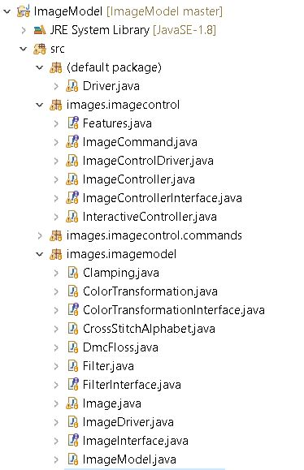

# Image Model

## Overview
Requirement is to build a model that can be used to manipulate images to produce some interesting effects.
- Loading and Saving Images:Standard representation is used where an image can be thought of as simply as a 3D array of integers with rows = height, columns = width and depth = 3. With 8-bit channels, each value is between 0 and 255.
- Filtering Images: A basic operation in many image processing algorithms is filtering. A filter has a "kernel", which is a 2D array of numbers, having odd dimensions (3x3, 5x5, etc.). Given a pixel in the image and a channel, the result of the filter can be computed for that pixel and channel.
- Color transformations: Filtering modifies the value of a pixel depending on the values of its neighbors. Filtering is applied separately to each channel. In contrast, a color transformation modifies the color of a pixel based on its own color. Consider a pixel with color LaTeX: (r,g,b)( r , g , b ). A color transformation results in the new color of this pixel to be LaTeX: (r',g',b')( r ′ , g ′ , b ′ ) such that each of them are dependent only on the values LaTeX: (r,g,b)( r , g , b ).
- Reducing color density: One of the ways to transform the colors in an image is to reduce the number of colors in the image.The technique for preserving the essence of the image breaks down an image that has many colors into an image that is made of dots from just a few colors is known as dithering. A popular technique to dither an image is the Floyd-Steinberg algorithm 
## List of features.
- Loading and Saving Images
- Filtering Images - Different filters like image blur and image sharpening could be applied.
- Color transformations- Different color transformations like grey scale and sepia tone could be applied.
- Reducing color density - Another way to transform the colors in an image is to reduce the number of colors in the image.

## How To Run. 

Image Model package will have the below mentioned folder structure: 



- jar file is saved in the \res folder

- Open the \res folder in command shell

- run the command as below, program does need two arguments from the user. Argument 1 is first image path and argument 2 is second image path
 
```sh
> java -jar .\ImageModel.jar .\Images\Image1\Original.png .\Images\Image2\Original.png
```
 
 
                              

 ## How to Use the Program.
     
There is no interaction with the user, so user just have to run the jar file as mentioned above with two arguments(image path)
    
## Description of Example Runs

Results of running the ImageModel.jar file

```sh  
PS C:\Manushi\ProjectsWorkSpace\ImageModel\res> java -jar .\ImageModel.jar .\Images\Image1\Original.png .\Images\Image2\Original.png
******************Starting Processing for first image******************

First image Loaded

Applied Color Transformation - Gray Scale on the original image

File saved at C:\Manushi\ProjectsWorkSpace\ImageModel\res\Images\Image1\GrayScale1.png

Applied Color Transformation - Sepia Tone on the original image

File saved at C:\Manushi\ProjectsWorkSpace\ImageModel\res\Images\Image1\SepiaTone1.png

Applied Filter - Blur on the original image

File saved at C:\Manushi\ProjectsWorkSpace\ImageModel\res\Images\Image1\Blur1.png

Applied Filter - Blur on the blured image

File saved at C:\Manushi\ProjectsWorkSpace\ImageModel\res\Images\Image1\Blur2.png

Applied Filter - Sharpness on the original image

File saved at C:\Manushi\ProjectsWorkSpace\ImageModel\res\Images\Image1\Sharp1.png

Applied Filter - Sharpness on the sharped image

File saved at C:\Manushi\ProjectsWorkSpace\ImageModel\res\Images\Image1\Sharp2.png

Reduced Color Density to 512(8X8X8) colors with essence on the original image

File saved at C:\Manushi\ProjectsWorkSpace\ImageModel\res\Images\Image1\ReduceCD512Colors.png

Reduced Color Density to 512(8X8X8) colors without essence on the original image

File saved at C:\Manushi\ProjectsWorkSpace\ImageModel\res\Images\Image1\ReduceCD512WithoutEssence.png

Reduced Color Density to 8(2X2X2) colors with essence on the gray scale image

File saved at C:\Manushi\ProjectsWorkSpace\ImageModel\res\Images\Image1\ReduceCD8GrayColors.png

******************Starting Processing for second image******************

Second image Loaded

Applied Color Transformation - Gray Scale on the original image

File saved at C:\Manushi\ProjectsWorkSpace\ImageModel\res\Images\Image2\GrayScale1.png

Applied Color Transformation - Sepia Tone on the original image

File saved at C:\Manushi\ProjectsWorkSpace\ImageModel\res\Images\Image2\SepiaTone1.png

Applied Filter - Blur on the original image

File saved at C:\Manushi\ProjectsWorkSpace\ImageModel\res\Images\Image2\Blur1.png

Applied Filter - Blur on the blured image

File saved at C:\Manushi\ProjectsWorkSpace\ImageModel\res\Images\Image2\Blur2.png

Applied Filter - Sharpness on the original image

File saved at C:\Manushi\ProjectsWorkSpace\ImageModel\res\Images\Image2\Sharp1.png

Applied Filter - Sharpness on the sharped image

File saved at C:\Manushi\ProjectsWorkSpace\ImageModel\res\Images\Image2\Sharp2.png

Reduced Color Density to 512(8X8X8) colors on the original image

File saved at C:\Manushi\ProjectsWorkSpace\ImageModel\res\Images\Image2\ReduceCD512Colors.png

Reduced Color Density to 512(8X8X8) colors without essence on the original image

File saved at C:\Manushi\ProjectsWorkSpace\ImageModel\res\Images\Image2\ReduceCD512WithoutEssence.png

Reduced Color Density to 8(2X2X2) colors on the gray scale image

File saved at C:\Manushi\ProjectsWorkSpace\ImageModel\res\Images\Image2\ReduceCD8GrayColors.png

********************Done********************
```
## These are the ouputs for different requirements:
- Original Image
  
  

- Filtering Images - Blur
  
  
  
- Filtering Images - Sharpness
  
  
 
- Color transformations - Grey Scale
  
  

- Color transformations - Sepia Tone
  
  

- Reducing color density - 8 values per channel
  
  

- Reducing color density - 8 values per channel with essence
  
  

- Reducing color density of grey scale image - 8 total colors with essence

  

## Design/Model Changes

### - Version 2.0
##### ImageModelInterface interface:
It provides the methods that can load and save images and manipulates images to produce some interesting effects.

##### ImageModel class:
This is the concrete implementation of the ImageModelInterface interface, which provides the implementation of all the required methods (load and save image, do color transformations, filter and reduce color density) This class also maintain the list of image observers, rgb buffer data and rgb buffer processed data.

##### FilterInterface interface:
It provides the methods to do filter manipulation like blur and sharpness on the image.

##### Filter class:
This is the concrete implementation of the FilterInterface interface, which provides the implementation of all the required methods.

##### ColorTransformationInterface interface:
It provides the methods to do color transformation manipulation like grey scale and sepia tone on the image.

##### ColorTransformation class:
This is the concrete implementation of the ColorTransformationInterface interface, which provides the implementation of all the required methods.

##### ReducingColorDensityInterface interface:
It provides the methods to reduce color density of the image.To transform the colors in an image, it reduce the number of colors in the image.
 
##### ReducingColorDensity class:
This is the concrete implementation of the ReducingColorDensityInterface interface, which provides the implementation of all the required methods.

##### ArrayCopyUtility class:
It provides the method to create a clone 3D Array.

##### Clamping class:
It provides the methods to "clamp" each value in each channel to avoid overflow and underflow while saving, and to display such images properly.

##### IImageController Interface class: 
It is an interface that is refer by Subject for updating state.

### - Version 1.0:
##### IImageController Interface class:
Provides interface functionality for the user/driver to perform functions save, read, blur, sharp, grey scale, sepia tone, reduce color dennsity 8 colors and reduce color density 16 colors on the image.
   
##### ImageController class:
Intuition for this class was to provide a handler between Image Model and Driver to perform functions save, read, blur, sharp, grey scale, sepia tone, reduce color dennsity 8 colors and reduce color density 16 colors on the image.
   
##### IImageModel Interface:
Provides the feature to initialize, get and set RGB buffer, register, remove and notify the observers
   
##### ImageModel class:
Concrete class which implements the IImageModel, which provides the feature to initialize, get and set RGB buffer, register, remove and notify the observers. It maintains the list of image observers, rgb buffer, height and weight of the image.

##### ImageProcessing Interface
Provides the functionality to read and save the image.
   
##### ImageProcessingImp class:
Concrete class which implements the ImageProcessing, it provides the functionality to read and save the image using image Utilities.

##### ColorTransformation Interface
Provides the functionalty to do color transformation of type Sepia Tone and Gray scale on the image.

##### AbstractColorTransformation class:
Abstract class which implements the ColorTransformation, which provides the feature to do color transformation of type Sepia Tone and Gray scale on the image. It maintains rgb buffer, height and weight of the image.

Concrete classes like SepiaTone and GrayScale extend AbstractColorTransformation, and provide the implemention of color transformated logic.

##### ColorTransformationVisitor interface:
It declares the visit operations for all the types of classes of type ColorTransformation which can be visited.

##### ColorTransformationHandler class
This class implements the ColorTransformationVisitor interface.

##### Filter Interface
Provides the functionalty to do filter of type Blur and sharpness on the image.

##### AbstractFilter class:
Abstract class which implements the Filter, which provides the feature to do filter of type Blur and sharpness on the image. It maintains rgb buffer, height and weight of the image and filter matrix.

Concrete classes like Blur and Sharp extend AbstractFilter, and provide the implemention of filter logic.

##### FilterVisitor interface:
It declares the visit operations for all the types of classes of type Filter which can be visited.

##### FilterHandler class
This class implements the FilterVisitor interface.

##### ColorDensity Interface
Provides the functionalty to do reduce color density of type 8 colors and 16 colors on the image.

##### AbstractColorDensity class:
Abstract class which implements the ColorDensity, which provides the feature to do reduce color density of type 8 colors and 16 colors on the image. It maintains rgb buffer, height and weight of the image and dither matrix.

Concrete classes like Color8 and Color16 extend AbstractColorDensity, and provide the implemention of reduce color density logic.

##### ColorDensityVisitor interface:
It declares the visit operations for all the types of classes of type ColorDensity which can be visited.

##### ColorDensityHandler class
This class implements the ColorDensityVisitor interface.

##### Clamping class:
This provides the functionality to clamp the channel values.

##### ColorTransformationVisitor interface:
It declares the visit operations for all the types of classes of type IGear which can be visited (# of gears allowed for a particular type, to get strength of particular type attack or defense, to get the count of particular gear type)

##### IImageController Interface class: 
It is an interface that is refer by Subject for updating state.

# ASSUMPTIONS
 
1) This will support only RGB representation of images
  
# Limitations
- None
 
# Citations
- https://pixabay.com/photos/road-forest-fall-autumn-season-1072823/
- https://pixabay.com/photos/bird-fluttering-berries-wings-tit-1045954/

